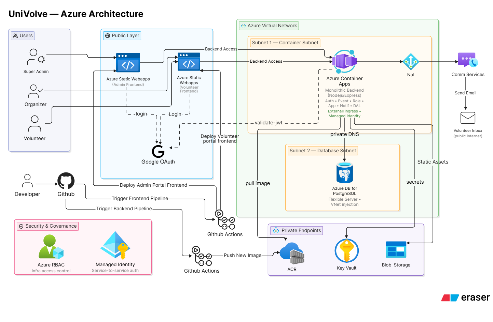

# UniVolve Infrastructure

Terraform infrastructure for the UniVolve university volunteering and event management system.

## Architecture



## Resources Created

Terraform creates or manages:

- Resource group and required Azure resource provider registrations
- Virtual network with delegated Container Apps and PostgreSQL subnets
- Private DNS zones and private endpoints for PostgreSQL, Key Vault, ACR, and Blob Storage
- PostgreSQL Flexible Server and application database
- Azure Container Registry
- Log Analytics workspace and Container Apps environment
- Public backend Container App with a user-assigned managed identity
- Key Vault and application secrets
- Blob Storage account and private `avatars` container configuration
- Azure Communication Services and email domain
- Admin and volunteer Azure Static Web Apps

## Prerequisites

Install and authenticate:

- Azure CLI
- Terraform >= 1.5
- Docker, for building the backend image locally if needed
- A Google Cloud project with a Web application OAuth client
- GitHub access to both `UniVolve-Infra` and `UniVolve`

Login and select the subscription:

```powershell
az login
az account set --subscription "<subscription-id>"
az account show --output table
```

## Remote Terraform State

Create the state storage account and container. Storage account names are globally unique.

```powershell
az storage account create --name vmsterraformstate --resource-group <resource_group_name> --location southeastasia --sku Standard_LRS --kind StorageV2 --allow-blob-public-access false
```

```powershell
az storage container create --name tfstate --account-name vmsterraformstate --resource-group <resource_group_name> --auth-mode login --public-access off
```

Initialize ``.github/workflows/terraform.yaml`` with:

```text
Set-Location "<workspace>\UniVolve-Infra\terraform"
terraform init `
  -backend-config="resource_group_name=<resource_group_name>" `
  -backend-config="storage_account_name=vmsterraformstate" `
  -backend-config="container_name=tfstate" `
  -backend-config="key=vms.terraform.tfstate" `
  -backend-config="use_azuread_auth=true"
```

## GitHub Actions Credentials

### Create Azure Service Principle

Create or use an existing service principal. The client ID must be the application/client ID, not the object ID:

```powershell
az ad sp create-for-rbac --name github-univolve-terraform --role Contributor --scopes "/subscriptions/<subscription-id>"
```

Map the command output as follows:

```text
ARM_CLIENT_ID = appId
ARM_CLIENT_SECRET  = password  
ARM_SUBSCRIPTION_ID = subscription
ARM_TENANT_ID = tenant
```

The Terraform service principal needs `Storage Blob Data Contributor` on this storage account.

```powershell
az role assignment create --assignee "<client-id>" --role "Storage Blob Data Contributor" --scope "/subscriptions/<subscription-id>/resourceGroups/<resource_group_name>/providers/Microsoft.Storage/storageAccounts/vmsterraformstate"
```

### Create Google Auth Clientid

In Google Cloud Console, create one OAuth client:

```text
GOOGLE_CLIENT_ID  = "<google-client-id>.apps.googleusercontent.com"
```

### Other Variables

```text
DB_ADMIN_PASSWORD = "<strong-postgres-password>"
JWT_SECRET        = "<long-random-secret>"
SUPER_ADMIN_EMAILS = "admin@example.com"
```

Add these values to `UniVolve-Infra -> Settings -> Secrets and variables -> Actions`.


## Terraform default Values

The default values include:

```text
prefix:             univolve-prod
location:           Southeast Asia
swa_location:       East Asia
db_admin_username:  univolveadmin
db_name:            univolvedb
ACR:                acrunivolveprod
```

Run the `Terraform Infrastructure` GitHub Actions workflow manually. Choose `plan`, `apply`, or `destroy`.

Azure resource provider registrations are subscription-level. Azure may delete all resource-group resources successfully but reject unregistering `Microsoft.App` or `Microsoft.Communication` with HTTP 409 if other resources use those providers. Leaving those providers registered is normal and harmless.

